# Blog to Wiki Demo

A demonstration of converting a blog to a wiki using AI.

LLM models are used for AI and MkDocs for the wiki.

The example blog used is https://jouninlappujuoksut.blogspot.com/ (blogspot.com) and the result is rendered to https://emick.github.io/blog-to-wiki-demo/

## Setup

1. Clone this repository
2. Install pipx: `pip install pipx` 
3. Install uv: `pipx install uv` 

## Local development

To run the site locally:

```bash
uv run mkdocs serve
```

This will start a local server.

## Convert blog to wiki

```bash
# Download blog
uv run 1-download-blog.py

# Create Table of Contents
uv run --env-file .env 2-create-table-of-contents.py

# Manually validate and edit table-of-contents.txt

# Convert to wiki
uv run --env-file 3-convert-to-wiki.py

# Tune extra instructions in table-of-contents.txt and iterate individual articles if necessary
uv run --env-file .env 3-convert-to-wiki.py --file "wiki/Kisat/Kesäyön 60.md"

# Publish to github pages
uv run mkdocs gh-deploy --force
```

The resulting wiki can be found in https://emick.github.io/blog-to-wiki-demo/

## Process diagram

```mermaid
flowchart TD
    S1B["💻 Blogitekstien lataus"]
    S2A["✨ Sisällysluettelon luonti<br><br>Malli: o3<br>Konteksti: koko blogi"]
    MAN["✎ Manuaalinen sisällysluettelon tarkistus ja muokkaus"]

    subgraph STEP3["Muunnos blogista wikiksi"]
        direction LR
        P1["✨ Tiivistelmä aiheesta<br/><br/>Malli: o3<br/>Konteksti: koko blogi"]
        P2["✨ Tuloksen siivous<br/><br/>Malli: o3<br/>Konteksti: tiivistelmä"]
        P3["✨ Markdown-muunnos<br/><br/>Malli: o4-mini<br/>Konteksti: tiivistelmä, sisällysluettelo, tiedostopolku"]
        P4["✨ Lähteiden haku<br/><br/>Malli: o4-mini<br/>Konteksti: tiivistelmä, koko blogi"]

        P1 --> P2 --> P3 --> P4
    end

    S1B --> S2A --> MAN --> STEP3
    STEP3 --> STEP3ITER["✎ Manuaalinen iterointi ja korjaus"]
```



## GitHub Pages notes

- Repository must be public
- Pages must be activated in classic mode and `gh-pages` branch selected with root folder as source.

## License

See the [LICENSE](LICENSE) file for details.
